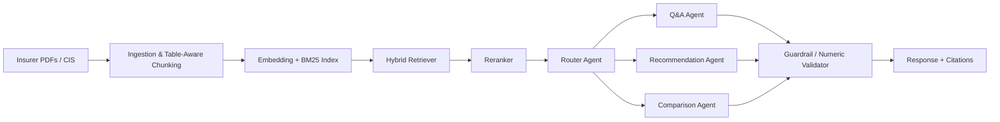

# Product Requirements Document: PolicyMitra
### AI-Powered RAG Assistant for Indian Health Insurance

**Version:** 0.1 (Draft)
**Date:** July 2026
**Status:** Pre-build / Planning
**Owner:** [you]

*(PolicyMitra is a placeholder name — "mitra" is Hindi for friend. Rename freely.)*

---

## 1. Executive Summary

PolicyMitra is an LLM-powered assistant for the Indian health insurance market with three integrated modules: (1) a policy FAQ/claims-explainer chatbot grounded in actual insurer documents, (2) a plan-recommendation engine that ranks policies against a buyer's profile, and (3) an agent copilot that helps human insurance agents/POSPs draft accurate, client-ready explanations faster.

The core bet: Indian health insurance is dense, table-heavy, and full of policy-specific gotchas (waiting periods, room-rent capping, co-pay, sub-limits, PED clauses) that neither generic chatbots nor most existing comparison sites explain well or verifiably. The product's differentiator is **traceable accuracy** — every factual claim grounded in a cited source document — not conversational polish.

## 2. Problem Statement

- Policy wordings run 40–80 pages of dense legal/actuarial language; most buyers never read them and discover exclusions at claim time.
- Comparison portals show premium and headline sum insured but bury waiting periods, sub-limits, and room-rent capping — the terms that actually determine claim payout.
- Existing chatbots (insurer-side or generic LLMs) either can't cite a source or hallucinate specific numbers, which is actively dangerous in an insurance context.
- Agents selling multiple insurers' products rely on memory or a PDF in another tab; consistency across client conversations suffers.
- English-only tooling excludes a large share of the addressable market.

## 3. Goals & Non-Goals

**Goals**
- G1: Answer policy-specific questions with ≥95% factual accuracy against source documents (golden Q&A eval set, §11).
- G2: Every generated factual claim (numbers, waiting periods, exclusions) is traceable to a specific clause/page.
- G3: Recommendation output explains trade-offs in plain language, not just a ranked list.
- G4: System refuses/flags rather than guesses when retrieval confidence is low.
- G5: Ship an MVP (Module 1 only) usable by a non-technical person before building Modules 2–3.

**Non-Goals (v1)**
- Not selling or binding policies — no payment/issuance flow.
- Not a replacement for licensed advice — positioned as an information and comparison aid.
- Health insurance only — not life, motor, or general insurance in v1.
- Not building a proprietary underwriting/pricing model — premiums shown are insurer-published, not calculated.

## 4. Target Users

**Persona 1 — Priya, first-time buyer (28, IT professional, Bangalore)**
Wants a policy for herself + parents. Overwhelmed by 15+ insurer options, doesn't know what "sub-limit" or "co-pay" means. Wants a plain-language recommendation with reasoning, not just a table.

**Persona 2 — Arjun, existing policyholder (45, planning a surgery)**
Has a 3-year-old policy. Wants to know: is this covered, what's my room-rent cap, will I get co-pay'd, should I port to a better insurer at renewal. High-anxiety, time-sensitive queries.

**Persona 3 — Vikram, POSP/agent (licensed intermediary, Tier-2 city)**
Sells 4–5 insurers' products. Needs fast, accurate comparison talking points for client calls and a way to draft a WhatsApp-ready explanation without re-reading the prospectus each time.

## 5. Scope — Three Modules

### 5.1 Module 1: Policy FAQ & Claims Explainer (RAG chatbot)
Consumer-facing chatbot grounded in ingested policy wordings/prospectuses. Answers "what's my waiting period for X," "is Y procedure covered," "what's my room rent limit" — always with a citation to the source clause. Architecture in `agents.md`; capability breakdown in `skills.md`.

### 5.2 Module 2: Plan Recommendation Engine
Takes a structured profile (age, family size, city tier, existing conditions, budget, sum-insured target) and returns a ranked shortlist with explicit trade-offs (e.g., "lower premium but 4-year PED wait here vs. 2-year there"). Includes a renewal/portability advisor that flags when porting to another insurer preserves accrued waiting-period credit and is financially worth it.

### 5.3 Module 3: Agent Copilot (B2B)
Same retrieval/comparison core, exposed as a tool for licensed agents: structured comparison tables, auto-drafted client explanations, objection-handling reference.

## 6. Functional Requirements

*(M=Must, S=Should, C=Could, this-phase)*

| ID | Requirement | Priority | Module |
|---|---|---|---|
| F1 | Natural-language question → answer with clause-level citation | M | 1 |
| F2 | Explicit "not found in source documents" instead of guessing, below a confidence threshold | M | 1 |
| F3 | User can reference their own uploaded policy document for personalized Q&A | S | 1 |
| F4 | Structured profile intake (age, dependents, city tier, PED, budget) via form or conversational flow | M | 2 |
| F5 | Ranked shortlist (3–5 plans) with a one-line "why this rank" per plan | M | 2 |
| F6 | Portability opportunities flagged at renewal with waiting-period-credit math shown | S | 2 |
| F7 | Side-by-side comparison table for 2–4 named plans on demand | M | 3 |
| F8 | Client-ready summary message (email/WhatsApp) generated from a comparison | S | 3 |
| F9 | Every numeric claim (%, ₹, days) validated against retrieved source text before display | M | 1,2,3 |
| F10 | Hindi language support for Module 1 Q&A | C | 1 |
| F11 | Query/document audit log for traceability and debugging | S | all |

## 7. Non-Functional Requirements

- **Accuracy over fluency**: a terse, correct, cited answer beats a warm but unverifiable one — the top design priority.
- **Latency**: <4s for a cited FAQ answer (p50), <8s (p95). Recommendation ranking can run async/batched.
- **Freshness**: policy wordings must be re-ingested on every insurer product revision — this needs a scheduled re-ingestion trigger, not a one-time load.
- **Auditability**: every answer reproducible — store the exact chunk IDs used for each response.
- **Data privacy**: see §12.
- **Availability**: 99% during business hours is sufficient for MVP; not a 24/7 critical system at this stage.

## 8. Data Requirements & Sources

- Policy wordings, prospectuses, and claim-form PDFs sourced directly from insurer websites (Star Health, Niva Bupa, Care Health, HDFC Ergo, ICICI Lombard, others as prioritized).
- IRDAI master circulars on health insurance — IRDAI has mandated standardized definitions for many common exclusions, which helps consistency across insurers.
- The standardized **Customer Information Sheet (CIS)** IRDAI now requires per product is a strong first ingestion source — simpler and more structured than full wordings, good for an early pilot corpus.
- No claims/underwriting data is required for v1 — documents in, grounded answers out, not a predictive model.
- Licensing note: check each insurer's terms of use before scraping; prefer direct download links over scraping where ToS/robots.txt restrict automated access.

## 9. System Architecture (High Level)

Full agent responsibilities: `agents.md`. Capability breakdown: `skills.md`. Memory/session design: `memory.md`.

## 10. Tech Stack (Proposed)

| Layer | Recommendation | Why |
|---|---|---|
| Generation | Claude (Sonnet-class), Haiku-class for routing | Strong instruction-following for "answer only from context"; cheap tier for classification |
| Grounding | Anthropic's Citations API (`custom content documents`) | Lets you pass your own table-aware chunks and get back character/block-level citations tied to those exact chunks, instead of hand-rolling a "cite your source" prompt — better recall/precision than prompt-based citation and doesn't bill cited text as output tokens |
| Embeddings | Voyage AI, or an open alternative (bge-large, e5) if cost-sensitive | — |
| Vector store | pgvector (one datastore for structured + vector) or Qdrant (dedicated, native hybrid search) | Pick based on whether you want one system or two |
| Keyword/BM25 | OpenSearch, or a vector DB with built-in hybrid search | Avoid running two full systems if you don't need to |
| Backend | Python + FastAPI | Natural fit for a RAG pipeline |
| Orchestration | Lightweight custom router for 4–5 agents | Only reach for LangGraph or similar once the agent graph has real branching complexity |
| Frontend | Next.js web chat for MVP; WhatsApp Business API early | A large share of Indian insurance service already happens over WhatsApp |

Note: the Citations API doesn't accept `.csv`/`.xlsx`/`.docx` as document blocks directly — convert to plain text or PDF, or use custom content documents where you control chunking yourself (the better option here, since you need table-row-level chunk boundaries anyway).

*(Defaults to move fast, not hard requirements — swap freely.)*

## 11. Evaluation Strategy

- Build a golden set of 100–150 Q&A pairs across 5–6 insurers covering waiting periods, room-rent, co-pay, sub-limits, and common exclusions, with answers hand-verified against source PDFs.
- Track: retrieval recall@k, answer faithfulness (is every claim supported by the retrieved chunk — the critical metric for this domain), and citation accuracy (does the cited clause actually say what's claimed).
- Run the golden set after every change to chunking, retrieval, or prompts — a regression suite, not a one-time benchmark.
- For Module 2, validate ranking logic against 10–15 hand-worked scenarios where you derive the "right" answer independently first.

## 12. Regulatory & Compliance Considerations

*(Non-exhaustive starting checklist, not legal advice — confirm with counsel before any commercial launch. Landscape as of mid-2026; this is actively moving, re-check before Phase 2/3.)*

**Insurance solicitation (IRDAI)**
- IRDAI licenses specific intermediary categories to solicit or compare insurance commercially: Insurance Agent, POSP, Broker, and **Insurance Web Aggregator** (governed by the IRDAI (Insurance Web Aggregators) Regulations, 2017). A web aggregator registration requires ₹25 lakh minimum paid-up capital, a principal officer who's cleared IRDAI's exam, and ongoing compliance reporting — roughly 18 entities hold this license today, and it's a real 5–6 month process, not a checkbox. This is the specific gate **Module 2** would need to clear to operate commercially at scale for real transacting users.
- **Module 1** (explain-only, no ranking/solicitation) sits outside this gate — explaining terms of a policy someone already has, or general concepts, isn't soliciting a purchase.
- **Module 3** is the lowest-friction path to something commercial soon: the licensed human agent, not the tool, remains the accountable party for advice given.
- IRDAI's 2025 Regulatory Sandbox Regulations (notified January 2025) meaningfully broadened what can be tested under regulatory relaxation rather than a full license — worth investigating as a path to pilot Module 2 with real users before pursuing full aggregator registration.
- IRDAI announced a dedicated AI working group in June 2026 tasked with building the sector's first formal AI governance framework, explicitly flagging explainability and audit trails as priorities. Nothing binding yet, but the direction (human-in-the-loop review, provable decision trails) is exactly what the Guardrail Agent in `agents.md` is designed around — building it in now costs less than retrofitting later.

**Data protection (DPDP Act)**
- The DPDP Act 2023 and its Rules (notified November 2025) are live in phases: the Data Protection Board is operating now, the Consent Manager framework activates November 2026, full enforcement lands May 2027. Treat 2026 as the build year, not "wait and see."
- Unlike GDPR, the DPDP Act does **not** carve out a distinct "sensitive/special category" legal tier for health data. That doesn't lower the bar in practice: purpose limitation, consent, and deletion-on-request apply to any personal data collected, so PED flags and ailment mentions should get the same handling discipline you'd give a special category anyway (see `memory.md` §5).
- Breach notification is stricter than GDPR's — every breach must be reported, not just material ones. Design the audit log in `memory.md` assuming disclosure may be required, from day one.

**General**
- Always display a visible disclaimer that outputs are informational, not a substitute for reading the actual policy document or consulting a licensed advisor.

## 13. Risks & Mitigations

| Risk | Mitigation |
|---|---|
| Hallucinated numeric claims (premium, %, days) | Guardrail agent cross-checks every number against retrieved source text before display; refuse if unverifiable |
| Stale policy data after an insurer revises wording | Scheduled re-ingestion + document versioning; timestamp every answer with source doc version |
| Regulatory exposure if Module 2 reads as solicitation at scale | Keep Module 2 informational-only at MVP (no purchase flow, no commission); investigate sandbox route before commercializing |
| Table-heavy PDFs break naive chunking | Table-aware extraction is a first-class pipeline step — see `skills.md` |
| Evolving IRDAI AI governance framework changes expectations | Build explainability/audit trail in from the start rather than bolt on later |
| Users over-trust an AI answer on a high-stakes claim decision | Persistent disclaimer + "confirm with insurer" nudge on claim-outcome-adjacent answers |

## 14. Roadmap

- **Phase 0** (this doc + scaffolding): architecture docs, ingest 3–5 insurers' CIS + wordings for a pilot corpus.
- **Phase 1 (MVP)**: Module 1 only — FAQ/claims explainer, web chat, English only, 5-insurer corpus, golden-set eval passing.
- **Phase 2**: Module 2 recommendation engine + portability advisor. Revisit §12 licensing/sandbox question before any real-user commercial launch.
- **Phase 3**: Module 3 agent copilot; Hindi language support; WhatsApp channel.

## 15. Success Metrics

- Faithfulness score ≥95% on the golden eval set before calling Module 1 "done."
- Retrieval recall@5 ≥90% on the golden eval set.
- Qualitative: 10 real users can answer a real question about their own policy without opening the PDF themselves.

## 16. Open Questions

- Which 5 insurers form the pilot corpus?
- Personal/portfolio project, or intent to eventually commercialize? (Changes how much weight §12 needs before Phase 2.)
- Hosting budget/constraints — affects vector DB and LLM tier choice.
